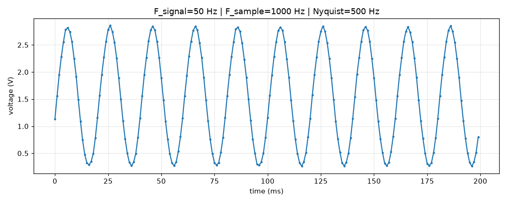
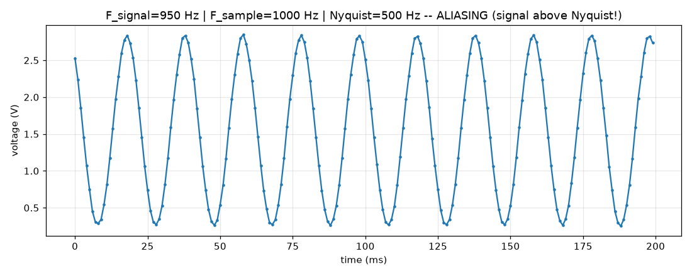
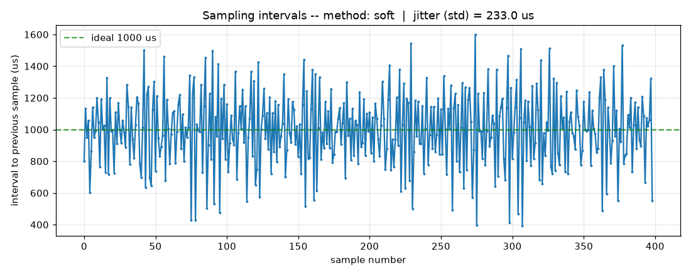
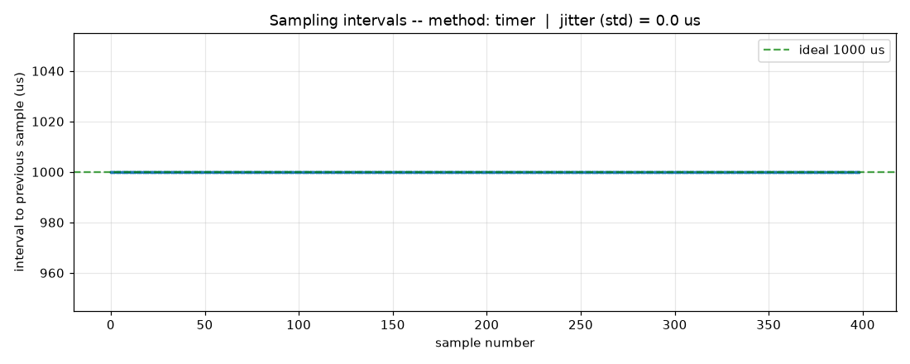
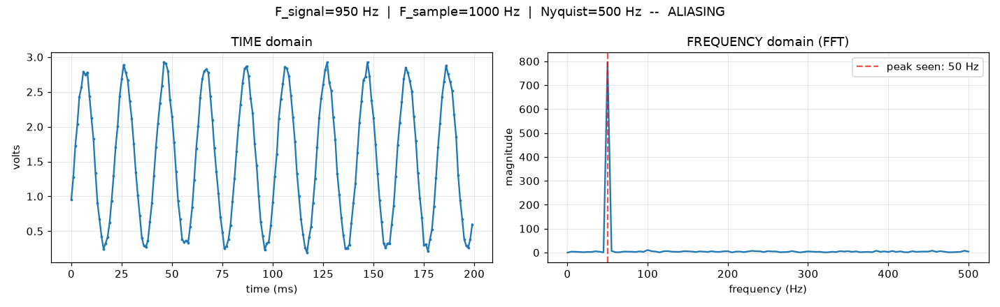
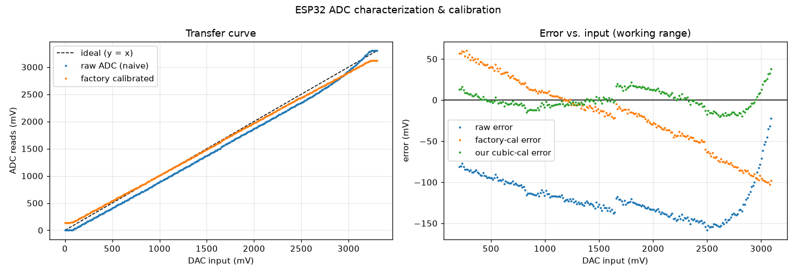
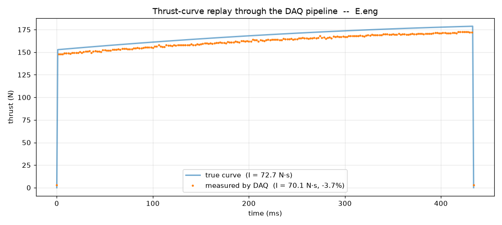
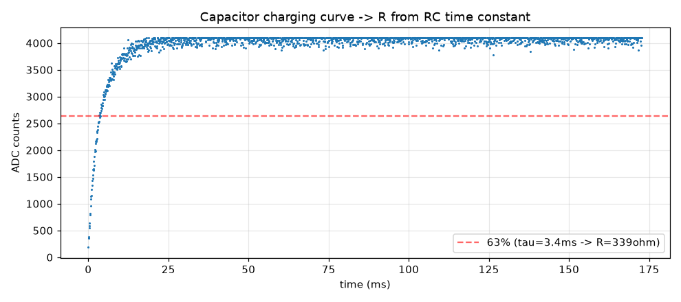

# 04 · Avionics — Data-Acquisition System

> Written to be understood from scratch. If you know what a variable is, you can
> follow this. Every concept is explained before it is used.

The static test needs an **instrument**: something that records *how much thrust*
and *how much pressure* the motor produces, moment by moment, during a burn that
lasts less than half a second. That instrument is a **data-acquisition system**
(DAQ). This document builds one on an ESP32, starting from the very idea of
"measuring a signal."

**Code:** [`avionics/daq-fase1/`](../avionics/daq-fase1/)

---

## Part 0 · What does it mean to "measure a signal"?

A **signal** is a value that changes over time — for example, the voltage coming
out of a pressure sensor. In the real world that value is **continuous**: it
exists at *every* instant, with infinite detail.

A microcontroller (the ESP32) cannot store infinite detail. It measures the
signal in **snapshots**, at regular time intervals. Each snapshot is a **sample**.
Turning a continuous signal into a list of samples is called **sampling**, and
the part of the chip that reads the voltage and turns it into a number is the
**ADC** (Analog-to-Digital Converter).

So a DAQ is really three questions:
1. **How often** do I take a snapshot? (sampling rate)
2. **How accurately** does each snapshot capture the real voltage? (ADC quality)
3. **How exactly on time** does each snapshot happen? (timing / jitter)

Phase 1 answers question 1. Phase 2 answers questions 3 (timing) and, with the
FFT, gives us a powerful new way to *check* question 1.

---

## Part 1 · Phase 1 — Sampling rate, Nyquist, and aliasing

### The core question

If a signal wiggles up and down quickly, how often must I take snapshots so I
don't miss the wiggles?

### The answer: the Nyquist–Shannon theorem

> To faithfully capture a signal, you must sample at **more than twice** the
> highest frequency present in it.

Half of your sampling rate has a name: the **Nyquist frequency**. Any real
frequency in your signal must stay *below* it. Sample at 1000 times per second
(1000 Hz) → your Nyquist frequency is 500 Hz → you can faithfully capture
anything up to 500 Hz.

### What happens if you break the rule: aliasing

If a signal is faster than your Nyquist frequency, it doesn't just "get blurry" —
something sneakier happens. It **disguises itself as a slower signal that was
never there.** This impostor is called an **alias**.

The everyday example: in movies, car wheels sometimes look like they spin
backwards or stand still. The camera samples (24 frames per second) slower than
the wheel spins, so the wheel *aliases* into a fake slow motion. Your eyes are
being lied to by the sampling rate.

### Seeing it for real

The ESP32 has a **DAC** (Digital-to-Analog Converter — the opposite of an ADC:
it *produces* a voltage). We make the ESP32 generate a known sine wave on its DAC
(pin GPIO25), connect a single jumper wire to its ADC (pin GPIO34), and let it
sample its own signal. By choosing the signal frequency and the sampling rate we
can obey or break Nyquist on purpose.

**Clean case — 50 Hz signal, sampled at 1000 Hz** (well below the 500 Hz Nyquist):



Ten clean cycles, ~20 samples each. Faithful.

**Broken case — 950 Hz signal, sampled at 1000 Hz** (above Nyquist):



The plot shows a ~50 Hz sine — **but the real signal is 950 Hz.** The math:
`|sampling − signal| = |1000 − 950| = 50 Hz`. The two plots above are nearly
identical: **from the samples alone, you cannot tell a real 50 Hz signal from a
950 Hz one in disguise.**

### Why this matters for the rocket

A motor's chamber pressure can carry fast oscillations (acoustic resonances).
If they are faster than your Nyquist frequency, they will appear in your data as
slow, gentle ripples — or vanish entirely — and you might design your next motor
believing everything was calm when it wasn't. **Choosing the sampling rate is a
safety decision, not a detail.**

---

## Part 2a · Phase 2 — Getting the *timing* right (interrupts & hardware timers)

Question 1 (how often) is not enough. The snapshots must also happen **exactly on
time**. If they don't, your time axis is wrong, and a signal measured on a wobbly
clock is a distorted signal.

### The problem with "soft" timing

The simplest way to sample every 1 ms is to keep checking the clock in the main
program loop:

```
loop forever:
    if the clock says 1 ms has passed since the last sample:
        take a sample
```

This is called **polling**. It has a fatal flaw: the loop can only check the
clock *between* doing other things. If the program is busy — reading another
sensor, writing to an SD card, doing a calculation — it **cannot check the clock
until it finishes**, so the sample lands late. Real programs are always busy with
something, so the timing wanders.

### The solution: interrupts and hardware timers

An **interrupt** is a mechanism where a piece of hardware can **force the CPU to
pause whatever it is doing, run a small special function immediately, and then
resume.** It is the electronic equivalent of a phone ringing: no matter how
focused you are, the ring pulls your attention *right now*.

A **hardware timer** is a dedicated counter inside the chip that ticks on its own,
completely independent of your program. We configure it to fire an interrupt at
exact intervals (every 1 ms). When it fires, the CPU is *forced* to stamp the
exact time — **even if it was in the middle of other work.** The main loop can be
as busy as it likes; the timer does not care.

This is the entire reason interrupts exist.

### The experiment

Both methods try to sample at 1000 Hz. To make the difference visible, every loop
iteration is delayed by a **random** amount (up to 700 µs) to simulate the
unpredictable workload of a real DAQ. We record the timestamp of every sample and
measure the **jitter** — how much the real spacing between samples wanders away
from the ideal 1000 µs. Low jitter = trustworthy timing.

**Code:** [`avionics/daq-fase1/timing_test/main.cpp`](../avionics/daq-fase1/timing_test/main.cpp)
· analysis: [`jitter_analysis.py`](../avionics/daq-fase1/jitter_analysis.py)

### The result

| Method | Jitter (std. dev.) | Worst-case late |
|--------|--------------------|-----------------|
| Soft polling | **233 µs** | 599 µs |
| Hardware timer | **0.0 µs** | 0 µs |

The soft method's sample spacing is chaos, bouncing between 400 and 1600 µs:



The hardware-timer method is a flat line at exactly 1000 µs — the interrupt fires
on time no matter how busy the CPU is:



**233 µs of jitter vs. 0.** On a 0.43 s burn, timing errors of hundreds of
microseconds smear the thrust curve and corrupt any frequency analysis. A real
DAQ must be interrupt-driven. (An honest note: here the interrupt records the
*trigger time*; the ADC value is read a few microseconds later in the loop. The
next refinement, Phase 2 continued, reads the ADC via DMA so even that tiny
latency disappears.)

---

## Part 2b · Phase 2 — A new pair of glasses: the frequency domain (FFT)

So far we have looked at signals as **voltage vs. time** — the "time domain." But
there is a second, equally valid way to look at the *same* signal: as a recipe of
the frequencies it is made of. This is the **frequency domain**, and the tool
that converts one into the other is the **Fourier Transform** (computed
efficiently as the **FFT**, Fast Fourier Transform).

### The idea, without the math

Any signal, however complicated, can be built by adding together pure sine waves
of different frequencies and strengths. The FFT does the reverse: you give it the
samples, and it tells you **"which frequencies are inside this signal, and how
strong is each one."**

Think of a musical chord: your ear hears one sound, but the FFT would show you the
three separate notes that make it up. A pure single tone shows up as a single
**peak** at its frequency.

### Why this is the perfect aliasing detector

In Phase 1 we saw aliasing by *eyeballing* two waveforms that looked identical.
The FFT turns that into a hard number: it shows us the exact frequency the ADC
*thinks* it is seeing.

**Clean case — real 50 Hz signal:** the FFT shows a single peak at **50 Hz**.
Correct.

**Aliased case — real 950 Hz signal, sampled at 1000 Hz:**



The left panel is the time domain (what we saw before). The right panel is the
FFT: a single sharp peak at **50 Hz** — even though the real signal is **950 Hz**.
The FFT is telling us, as a precise number, that our DAQ is being fooled. The
script prints it directly:

```
Real signal : 950 Hz
ADC sees    : 50 Hz  (expected 50 Hz)
```

**Code:** [`fft_analysis.py`](../avionics/daq-fase1/fft_analysis.py)

### Why this matters for the rocket

When we finally record a real thrust or pressure curve, the FFT is how we will
inspect it for hidden oscillations. A peak at a suspicious frequency in the
chamber-pressure spectrum is a warning of acoustic resonance — the kind of thing
that can destroy a motor. Learning to read the frequency domain now, on a signal
we control, means we will know how to read it later, on a signal that matters.

---

## Part 2c · Phase 2 — Trust, but verify: characterizing and calibrating the ADC

We now know *how often* to sample and *how* to time it. But there is one more
question: **how much can we trust the number each snapshot gives us?**

### What "calibration" means

Every measuring instrument lies a little. A ruler printed slightly wrong, a scale
that reads 2 g heavy — and an ADC whose readings drift from the truth, especially
near its voltage limits. **Calibration** is the act of measuring *how* an
instrument lies, so you can correct it. You compare its readings against a known
reference and build a correction. No serious measurement is trusted until the
instrument behind it is calibrated.

### The experiment

We sweep the DAC across its whole range (0 → 3.3 V) as a known test input, and at
each voltage read the ADC two ways:

- **raw** — `analogRead()` converted naively (count / 4095 × 3.3 V), what a
  beginner would write;
- **factory-calibrated** — `analogReadMilliVolts()`, which applies the
  per-chip calibration burned into the ESP32 at the factory.

We then fit **our own** correction (a cubic curve) to this specific chip and
compare all three against the input.

**Code:** [`adc_cal/main.cpp`](../avionics/daq-fase1/adc_cal/main.cpp)
· analysis: [`adc_cal.py`](../avionics/daq-fase1/adc_cal.py)

### The result



**Left — the transfer curve.** The ideal would be a perfect diagonal (what goes
in equals what is read). The raw ADC (blue) sags below it and bends at the ends;
the factory calibration (orange) pulls it closer.

**Right — the error of each method** across the working range:

| Conversion | Max error |
|------------|-----------|
| Naive raw `count/4095×3.3` | **159 mV** |
| ESP32 factory calibration | 103 mV |
| **Our own cubic calibration** | **38 mV** |

The raw ADC is off by up to **159 mV** — that would be a large, invisible error in
a pressure reading. The factory calibration cuts it to ~103 mV; a **custom
calibration fit to this exact chip** cuts it to ~38 mV. This is the whole point:
you characterize *your* instrument and build *your* correction.

We also measured the **noise floor** — the spread of repeated reads at a fixed
input: ~17 counts (~14 mV). That sets a hard limit on the finest change the raw
ADC can resolve, and motivates both averaging and the external ADC of a later
phase.

> Honest caveat: the DAC used as the reference is itself imperfect, so these
> numbers characterize the DAC→ADC *loopback*, not the ADC in isolation. A
> production calibration uses an external precision voltage reference. The
> *method* — sweep, compare to a reference, fit a correction, quantify the
> residual — is exactly the same, and it is the transferable skill.

### Why this matters for the rocket

When the DAQ finally records chamber pressure, an uncalibrated 159 mV error could
mean reading 3.2 MPa as 3.4 MPa — the difference between "nominal" and "over the
limit." **Calibration is what turns a voltage into a trustworthy measurement.**
Before the real sensor is ever connected, its whole chain (sensor → amplifier →
ADC) will be calibrated against known weights and pressures the same way.

---

## Part 4 · Phase 4 — The dress rehearsal: replaying a real thrust curve

Everything so far was building blocks. Now we assemble them into the **entire
static-test data pipeline and validate it end-to-end — with no motor.**

### The idea

We take a **real thrust curve** — the one openMotor produced for motor E
([`E.eng`](../simulation/internal-ballistics/E.eng), 72.74 N·s) — and make the
ESP32 *play it back* through its DAC, as if the motor were pushing in real time.
The ADC records it. We then reconstruct the thrust and **integrate it to recover
the total impulse.** If the DAQ measures a *known* curve's impulse correctly, we
can trust it to measure a real motor's.

### The one new concept: impulse is an integral

**Total impulse** is the area under the thrust-versus-time curve —
mathematically, the integral `I = ∫ F dt`. Intuitively: thrust is how hard the
motor pushes at each instant; impulse is the *total push* over the whole burn,
and it is what determines how high the rocket goes. We compute it numerically by
adding up the area of thin slices under the measured curve (the trapezoidal
rule). This is the single most important number a thrust stand produces.

### The pipeline, assembled

```
 .eng curve → DAC (play) → jumper → ADC (sample) → calibrate → integrate → impulse
   (openMotor)  (Phase 1)          (Phase 2a timer)  (Phase 2c)   (Phase 4)
```

**Code:** generator [`gen_thrust_firmware.py`](../avionics/daq-fase1/gen_thrust_firmware.py),
firmware [`thrust_replay/main.cpp`](../avionics/daq-fase1/thrust_replay/main.cpp),
analysis [`thrust_replay.py`](../avionics/daq-fase1/thrust_replay.py).

### The result



The measured curve (dots) tracks the true curve (line) closely — including the
gentle rise of the near-neutral BATES burn and the sharp start and stop. The
numbers:

| Quantity | True (from `.eng`) | Measured by DAQ | Error |
|----------|--------------------|-----------------|-------|
| **Total impulse** | **72.74 N·s** | **70.07 N·s** | **−3.7 %** |
| Peak thrust | 179 N | 173 N | −3 % |
| Burn time | 434 ms | 432 ms | −0.5 % |

**The DAQ recovered the impulse of a known curve to within 3.7 %.** The small
underestimate is a systematic gain offset from the imperfect DAC/ADC loopback —
exactly the kind of error the Phase 2c calibration is built to remove, and it
would shrink further with the external ADC and a real sensor calibrated against
known weights. Timing (burn duration) is essentially perfect, thanks to the
hardware timer from Phase 2a.

### Why this closes the "measure" stage

This is the dress rehearsal for the real static test. Every block is now proven
to work together: precise timing, correct sampling, calibrated readings, and a
trustworthy impulse integral — validated against a known answer before a single
gram of propellant is involved. When the aluminium motor finally fires on the
stand, the same pipeline will turn its thrust into a number we can believe.

---

## Part 3 · Phase 3 — An analog anti-aliasing filter, and a hard lesson in measurement rigor

Aliasing (Part 1) **cannot be undone in software** — once a fast signal has
disguised itself as a slow one, the samples are indistinguishable. The only real
cure is to remove the high frequencies **physically, before the ADC**, with an
analog filter. The simplest is a first-order **RC low-pass**: a resistor in
series and a capacitor to ground.

```
  GPIO25 --[ R = 220 ohm ]--+--> GPIO34
   (DAC)                     |    (ADC)
                          [ C = 10 uF ]
                             |
                            GND
```

Design cutoff: `fc = 1/(2*pi*R*C) ~= 72 Hz`.

### How this section earned its title

The first attempt to characterize the filter swept the signal frequency and
measured the surviving amplitude at each. It reported a cutoff of **4.6 Hz** —
more than ten times too low. Taken at face value, this implied ~3.4 kΩ of series
resistance that shouldn't exist, and led to an elaborate (and **wrong**)
conclusion that the ESP32 DAC was a "weak source" with kΩ output impedance.

Two things exposed the error:

1. **An independent measurement method.** Instead of sweeping frequency, a
   **step-response** measurement charges the capacitor through the resistor and
   times it: the time to reach 63 % of the final value is the RC time constant
   `tau`, and `R = tau / C`. This is immune to the flaw in the sweep. It gave a
   clean textbook charging curve:

   

   `tau = 3.4 ms`, and with `C = 10 uF` that gives **R ~= 220-340 Ω** — the
   resistor was 220 Ω all along, and the real cutoff is ~47 Hz, close to design.

2. **The vendor documentation.** The ESP32 DAC's real output resistance is
   ~20 Ω (it sources ~12 mA) — *not* kΩ. The measured contradiction was the tell.

### The root cause of the wrong number

The frequency-sweep firmware sampled the ADC at a limited rate while measuring
each tone's peak-to-peak amplitude. At higher frequencies there were **too few
samples per cycle**, so the min/max **missed the true peaks** and reported a
falsely low amplitude — a fake rolloff that faked a low cutoff. A classic
**measurement artifact** masquerading as physics.

**Code:** frequency sweep (with the pitfall) `rc_filter/main.cpp`; the reliable
step-response `step_test/main.cpp` and [`step_analysis.py`](../avionics/daq-fase1/step_analysis.py).

### The lesson (the most important one in this project)

A subtle measurement bug produced a confident, detailed, completely wrong
conclusion. What corrected it was **a second independent method and a check
against the datasheet** — not more thinking about the first result. One
measurement is a hypothesis; agreement across methods is a fact. This principle
is now the first entry in the project's [CLAUDE.md](../CLAUDE.md).

The filter itself works exactly as designed — cutoff ~47-72 Hz, passing low
frequencies and attenuating the high ones that would otherwise alias.

---

## What was also measured along the way

- **A real hardware bug:** the first captures read all-zero. The cause was an
  intermittent jumper wire on the header pins — *not* the code. A constant-voltage
  continuity test isolated it. **When bench hardware misbehaves, suspect the
  connection before the software.**

---

## Roadmap

```
Phase 1   sampling rate · Nyquist · aliasing                    ✅
Phase 2a  deterministic timing (hardware-timer interrupts)      ✅
Phase 2b  the frequency domain (FFT)                            ✅
Phase 2c  ADC characterization & calibration curve             (next, ESP32 only)
Phase 3   analog anti-aliasing RC filter (measured via step-response)   ✅
Phase 4   full dry-run: play a real thrust curve, sample, integrate impulse   ✅
Phase 5   load cell (Wheatstone bridge) → instrumentation amp → real thrust
Phase 6   flight computer: IMU + barometer sensor fusion (Kalman filter)
```

The engineering arc: **measure → estimate → control.** Everything here is the
"measure" foundation — get the numbers right first, honestly, before trusting
anything built on top of them.

## Files

| File | Purpose |
|------|---------|
| `main.cpp` | Phase 1 firmware: DAC sine generation + ADC sampling |
| `timing_test/main.cpp` | Phase 2a firmware: soft vs. hardware-timer sampling |
| `plot.py` | Plots one capture in the time domain |
| `fft_analysis.py` | Plots a capture in both time and frequency domains |
| `jitter_analysis.py` | Measures the timing jitter of a sampling method |
| `adc_cal/main.cpp` | Phase 2c firmware: DAC sweep for ADC characterization |
| `adc_cal.py` | Characterizes and calibrates the ADC transfer curve |
| `thrust_replay/main.cpp` | Phase 4 firmware: plays a real thrust curve out the DAC |
| `gen_thrust_firmware.py` | Generates the replay firmware from a `.eng` file |
| `thrust_replay.py` | Reconstructs thrust, integrates impulse, validates the pipeline |
| `platformio.ini` | Build configuration (board `esp32dev`, Arduino framework) |
